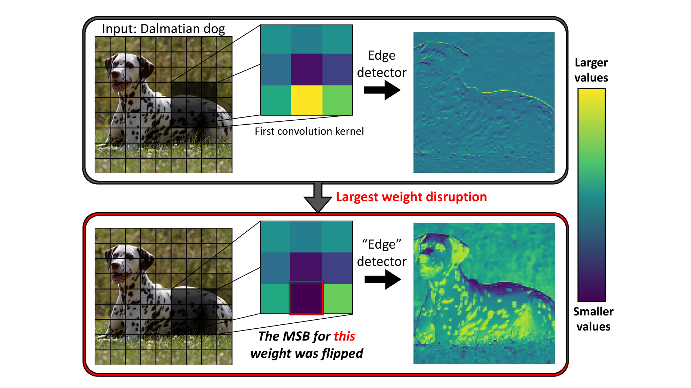

# Maximal Brain Damage Without Data or Optimization: Disrupting Neural Networks via Sign-Bit Flips

[Paper](<paper URL goes here>) | [Demo Notebook](demo.ipynb)

This repository provides an implementation of the sign-bit attacks introduced in *Maximal Brain Damage Without Data or Optimization: Disrupting Neural Networks via Sign-Bit Flips*. It includes a demonstration notebook with two examples:

- Image classification with EfficientNet-B0
- Language generation with Qwen3-30B-A3B-Thinking-2507

<p>
  
</p>

## Repository

- `demo.ipynb`: End-to-end demonstration notebook
- `src/deep_neural_lesion/`: Attack helpers used by the notebook
- `assets/`: Images (the dalmatian image used in the notebook and Figure 1 from the paper)

## Getting started

```bash
uv sync
uv run jupyter notebook demo.ipynb
```

## What the notebook covers

### Image classification

The image section uses EfficientNet-B0, available in the `timm` model repository, on a dalmatian image. It shows the clean prediction, then the effect of DNL, then the effect of 1P-DNL.

### Language generation

The language section uses `Qwen3-30B-A3B-Thinking-2507`. It first generates with the clean model and then reruns the same prompt after DNL and 1P-DNL.
